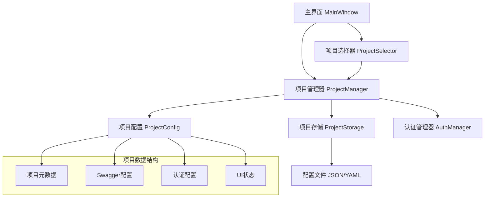

# 项目工作区管理功能设计文档

## 概述

项目工作区管理功能旨在解决多项目开发时频繁切换 API 文档的痛点。通过提供项目保存、管理和快速切换功能，让开发者能够高效地在不同项目间切换，无需重复加载 Swagger 文档。

## 架构设计

### 整体架构



### 核心组件关系

- **ProjectManager**: 核心管理类，协调所有项目相关操作
- **ProjectStorage**: 负责项目数据的持久化存储
- **ProjectConfig**: 项目配置数据模型
- **ProjectSelector**: UI组件，提供项目选择和管理界面

## 组件和接口设计

### 1. ProjectManager 类

```python
class ProjectManager:
    def __init__(self, storage_path: str = "./projects")
    def create_project(self, name: str, description: str, swagger_source: dict) -> Project
    def load_project(self, project_id: str) -> Project
    def get_all_projects(self) -> List[Project]
    def delete_project(self, project_id: str) -> bool
    def get_recent_projects(self, limit: int = 5) -> List[Project]
    def set_current_project(self, project: Project) -> None
    def get_current_project() -> Optional[Project]
```### 2. Proje
ct 数据模型

```python
@dataclass
class Project:
    id: str
    name: str
    description: str
    swagger_source: SwaggerSource
    base_url: str
    auth_config: dict
    created_at: datetime
    last_accessed: datetime
    api_count: int = 0
    
@dataclass
class SwaggerSource:
    type: str  # "url" or "file"
    location: str  # URL or file path
    last_modified: Optional[datetime] = None
```

### 3. ProjectStorage 类

```python
class ProjectStorage:
    def __init__(self, storage_path: str)
    def save_project(self, project: Project) -> bool
    def load_project(self, project_id: str) -> Optional[Project]
    def load_all_projects(self) -> List[Project]
    def delete_project(self, project_id: str) -> bool
    def export_project(self, project_id: str, export_path: str) -> bool
    def import_project(self, import_path: str) -> Optional[Project]
```

### 4. ProjectSelector UI 组件

```python
class ProjectSelectorDialog(QDialog):
    project_selected = pyqtSignal(Project)
    
    def __init__(self, project_manager: ProjectManager, parent=None)
    def refresh_project_list(self) -> None
    def create_new_project(self) -> None
    def edit_project(self, project: Project) -> None
    def delete_project(self, project: Project) -> None
```

## 数据模型设计

### 项目配置文件结构

```json
{
  "id": "uuid-string",
  "name": "项目名称",
  "description": "项目描述",
  "swagger_source": {
    "type": "url|file",
    "location": "http://api.example.com/swagger.json",
    "last_modified": "2024-01-01T00:00:00Z"
  },
  "base_url": "http://api.example.com",
  "auth_config": {
    "bearer": {
      "token": "...",
      "use_prefix": true
    },
    "basic": {
      "username": "...",
      "password": "..."
    }
  },
  "ui_state": {
    "selected_api": null,
    "splitter_state": "...",
    "window_geometry": "..."
  },
  "metadata": {
    "created_at": "2024-01-01T00:00:00Z",
    "last_accessed": "2024-01-01T00:00:00Z",
    "api_count": 25,
    "tags": ["development", "api-testing"]
  }
}
```

### 全局配置文件

```json
{
  "current_project_id": "uuid-string",
  "recent_projects": ["uuid1", "uuid2", "uuid3"],
  "settings": {
    "auto_load_last_project": true,
    "max_recent_projects": 5,
    "backup_enabled": true
  }
}
```

## 错误处理策略

### 1. 文件访问错误
- **场景**: 配置文件损坏、权限不足
- **处理**: 显示错误对话框，提供修复或重置选项

### 2. 网络连接错误
- **场景**: URL 类型的 Swagger 文档无法访问
- **处理**: 显示连接错误，提供重试和离线模式选项

### 3. 数据格式错误
- **场景**: 项目配置文件格式不正确
- **处理**: 尝试自动修复，失败则提示用户手动处理

### 4. 项目冲突
- **场景**: 导入项目时名称或ID冲突
- **处理**: 提供重命名或覆盖选项

## 测试策略

### 单元测试
- ProjectManager 的所有公共方法
- ProjectStorage 的数据持久化功能
- Project 数据模型的验证逻辑

### 集成测试
- 项目创建到加载的完整流程
- 认证配置的保存和恢复
- UI 状态的保存和恢复

### 用户界面测试
- 项目选择对话框的交互
- 主界面的项目切换功能
- 错误场景的用户体验

### 性能测试
- 大量项目时的加载性能
- 频繁切换项目的响应时间
- 配置文件的读写性能## 
用户界面设计

### 1. 主界面集成

#### 工具栏扩展
- 添加"项目"下拉菜单，显示当前项目名称
- 包含"切换项目"、"保存项目"、"项目管理"选项
- 显示最近使用的3个项目快速访问

#### 状态栏信息
- 显示当前项目名称和API数量
- 显示项目最后更新时间

### 2. 项目管理对话框

#### 布局设计
```
┌─────────────────────────────────────────────────────────┐
│ 项目管理                                    [最小化][关闭] │
├─────────────────────────────────────────────────────────┤
│ [新建项目] [导入项目] [导出项目]                [刷新]    │
├─────────────────────────────────────────────────────────┤
│ 搜索: [________________]  排序: [最近使用 ▼]            │
├─────────────────────────────────────────────────────────┤
│ ┌─项目列表─────────────────────────────────────────────┐ │
│ │ 📁 电商API项目        [URL]  25个接口  2小时前       │ │
│ │ 📁 用户管理系统       [文件] 18个接口  1天前         │ │
│ │ 📁 支付网关API        [URL]  32个接口  3天前         │ │
│ └─────────────────────────────────────────────────────┘ │
├─────────────────────────────────────────────────────────┤
│ 项目详情:                                               │
│ 名称: 电商API项目                                       │
│ 描述: 电商平台的核心API接口测试                         │
│ 来源: https://api.shop.com/swagger.json                │
│ 基础URL: https://api.shop.com                          │
│ 创建时间: 2024-01-15 14:30                             │
├─────────────────────────────────────────────────────────┤
│                    [加载项目] [编辑] [删除] [取消]      │
└─────────────────────────────────────────────────────────┘
```

### 3. 新建/编辑项目对话框

#### 表单设计
```
┌─────────────────────────────────────────────┐
│ 新建项目                        [关闭]      │
├─────────────────────────────────────────────┤
│ 项目名称: [_________________________]      │
│                                             │
│ 项目描述: [_________________________]      │
│          [_________________________]      │
│                                             │
│ Swagger来源:                               │
│ ○ URL地址  ○ 本地文件                      │
│                                             │
│ 文档地址: [_________________________] [浏览] │
│                                             │
│ 基础URL:  [_________________________]      │
│ (可选，用于API测试)                         │
│                                             │
│ 标签: [development] [api] [+添加]           │
│                                             │
├─────────────────────────────────────────────┤
│              [保存] [测试连接] [取消]        │
└─────────────────────────────────────────────┘
```

## 实现细节

### 1. 配置文件管理

#### 目录结构
```
./projects/
├── global_config.json          # 全局配置
├── projects/
│   ├── project-uuid-1/
│   │   ├── config.json         # 项目配置
│   │   ├── auth.json          # 认证配置
│   │   └── cache/             # 缓存文件
│   └── project-uuid-2/
│       ├── config.json
│       ├── auth.json
│       └── cache/
└── backups/                    # 备份文件
```

### 2. 数据同步策略

#### 自动保存机制
- 项目切换时自动保存当前状态
- 认证配置变更时实时保存
- UI状态变化时延迟保存（防止频繁IO）

#### 冲突解决
- 检测配置文件修改时间
- 提供合并或覆盖选项
- 支持配置文件版本控制

### 3. 性能优化

#### 懒加载策略
- 项目列表只加载基本信息
- 详细配置在需要时才加载
- Swagger文档缓存机制

#### 内存管理
- 限制同时加载的项目数量
- 自动清理长时间未使用的项目缓存
- 优化大型Swagger文档的内存占用

## 扩展性考虑

### 1. 插件支持
- 支持第三方项目模板
- 允许自定义项目类型
- 提供项目导入/导出插件接口

### 2. 团队协作
- 支持项目配置的团队共享
- 版本控制集成
- 远程项目配置同步

### 3. 云端同步
- 支持云端配置备份
- 多设备间项目同步
- 团队项目共享平台